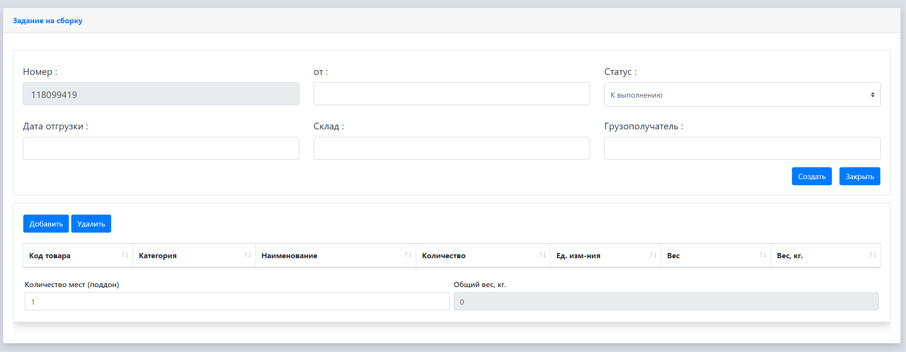
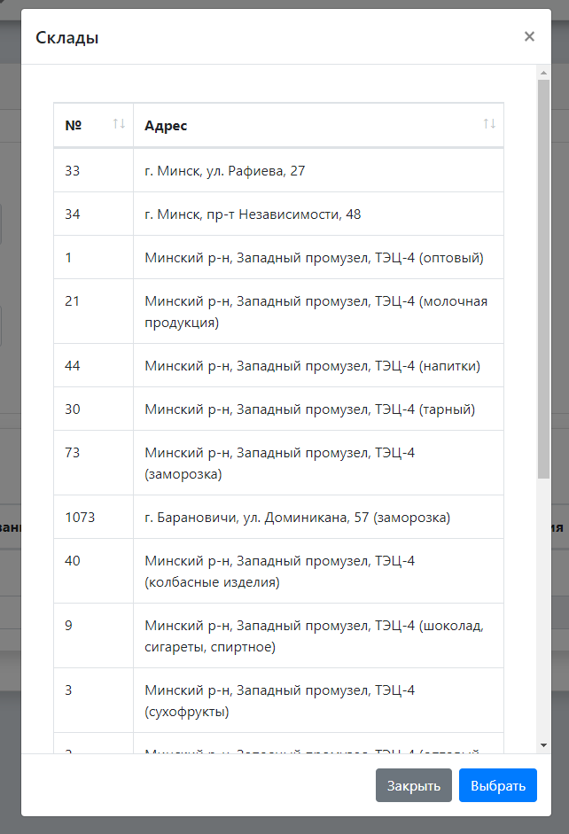
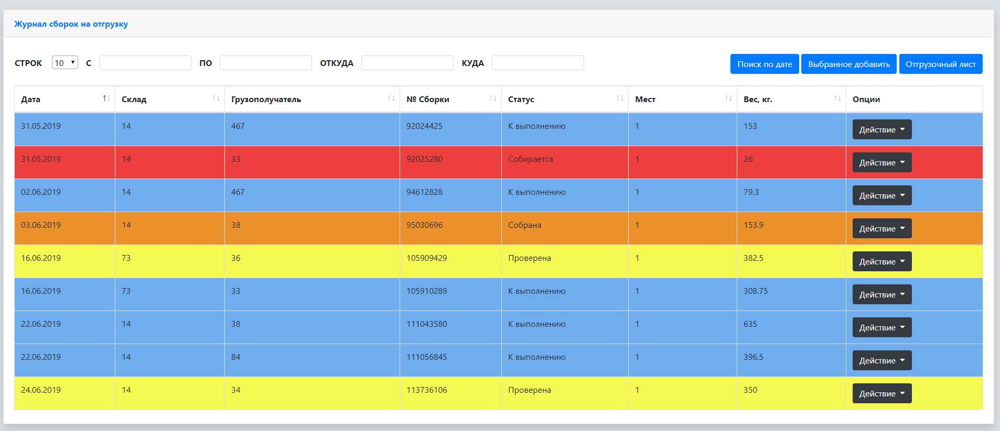

Deployed on heroku: [WMS Lite](https://wms-nodejs-app.herokuapp.com/) 
Authorization: Login - admin / Password - 123 

# Цель проекта

Разработать автоматизированную систему отгрузки товаров склада логистического центра предприятия розничной торговли, предназначенную для автоматизации учета заказов от собственной торговой сети. Внедрение данной системы приведет к упрощению и повышению скорости документооборота, надежности хранения информации и возможности в персонализированном её использовании через сеть Интернет для удаленного рабочего места сотрудников.

Для реализации данной цели создана база данных в среде документно-ориентированной СУБД MongoDB и разработан сайт системы отгрузки товаров со склада логистического центра предприятия при помощи языка JavaScript, Node.js, HTML, CSS представляющий собой веб-приложение связанное с этой базой данных.

# Функциональное назначение программы
Основное назначение веб-приложения «Автоматизированная система отгрузки товаров склада логистического центра»: вести учет сборочных ли-стов, товарно-транспортных накладных по отгрузке товаров со склада логи-стического центра; формировать отчеты по остаткам, предоставлять инфор-мацию о товарах, грузоотправителях и грузополучателях, документах.
Приложение обеспечивает:

* накопление информации о сборочных листах и ТТН в БД;
* накопление информации о товарах, грузоотправителях и грузополучателях в БД;
* ускорение процесса обработки сборочных листов и товарно-транспортных накладных;
* отслеживание результатов выполнения через Интернет;

# Эксплуатационное назначение программы.
Программный продукт приложения «Автоматизированная система отгрузки товаров склада логистического центра» должен эксплуатироваться сотрудниками логистического центра: администратором, логистом, учётчиком, экономистом.

# Состав функций.
Программный продукт приложения «Автоматизированная система от-грузки товаров склада логистического центра» обеспечивает возможность выполнения перечисленных ниже функций:
* комплектация товаров согласно заказам
* ведение базы данных в части формирования документов по списанию товаров со склада;
* вывод отчета об остатках товара на складе;
* получение информации о товарах, грузоотправителях, грузополуча-телях, документах.

# Руководство для логиста

После авторизации логисту предоставляется определенный набор страниц:
* Меню – Документы – Задание на сборку
* Меню – Журналы – Журнал сборок на отгрузку 

Рисунок 1 – Подпункты меню веб-приложения

Открыв подпункт «Задание на сборку» отобразится страница, на которой логист должен сформировать сборочный лист согласно заказанной про-дукции конкретного магазина.

Рисунок 2 – Страница «Задание на сборку»

Поле «Номер» формируется автоматический, оно будет указывать на номер сборочного листа.  
Поле «от» предусмотрено для указания даты создания сборочного ли-ста.  
Поле «Статус» является комбинированным список, откуда выбирается состояние сборочного листа. Зачастую выбирается значение «К выполне-нию», поэтому оно стоит по умолчанию, но в иных случаях можно выбрать и другие варианты.  
Поле «Дата отгрузки» обозначает дату, когда должны отгрузиться то-вары со склада логистического центра.  
Поле «Склад» предусмотрено для указания, с какого именно склада отгружаются товары. При нажатии на поле появится модальное окно, в котором нужно выбрать конкретный склад.

Рисунок 3 – Модальное окно «Склады»

Поле «Грузополучатель» указывает, куда следуют товары из сборочного листа. Точно таким же образом, как и поле «Склад», при нажатии на поле, появится модальное окно с выбором определенного грузополучателя.
Кнопка «Добавить» позволяет открыть модельное окно с выбором товаров по категориям. После выбора интересующих товаров, указывается их количество. Для выбора используется двойное нажатие ЛКМ, либо выделением конкретной позиции и нажатием кнопки «Выбрать».
Кнопка «Удалить» позволяет удалить из перечня выбранных товаров, в сформированной ниже таблице, лишние либо выбранные по ошибке. Для этого необходимо нажать ЛКМ на определенную строку в таблице и нажать кнопку «Удалить».
Поле «Количество мест (поддон)» говорит о том, чтобы указать на скольких поддонах разместятся заказанные товары для перевозки их в ма-шине.
Как только сборочный лист сформирован, нажимается кнопка «Со-здать». После нажимаем кнопку «Закрыть» или воспользоваться меню.
Далее переходим к другой странице «Журнал сборок на отгрузку».

Рисунок 4 – Страница «Журнал сборок на отгрузку»

Здесь отображается информация о созданных сборочных листах, которые будут собирать комплектовщики на складах.
Выше таблицы расположены поля для поиска сборочных листов по определённым критериям: 
– в полях «С» и «ПО» по дате. Выбирается конкретный интервал и нажимается кнопка «Поиск по дате»
– в полях «ОТКУДА», «КУДА» соответственно по номеру склада и грузополучателю. Поиск сработает автоматически, как только будет вписано значение.
В таблице в колонке «Опции» находятся кнопки действий, которые позволяют просмотреть и удалить конкретный сборочный лист.

To be continued...